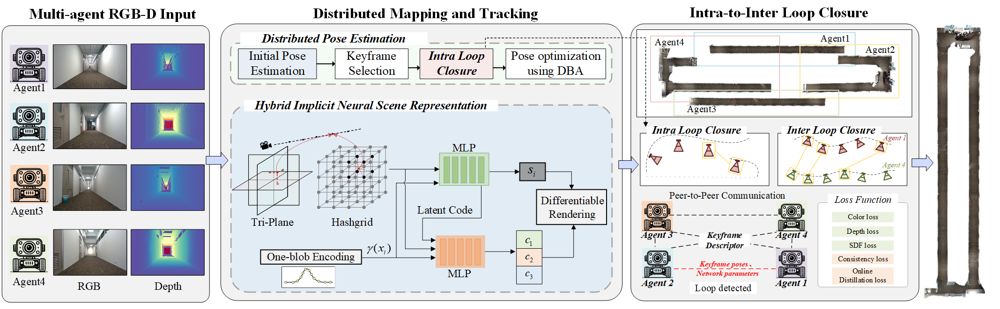

<h1 align="center">
MCN-SLAM: Multi-Agent Collaborative Neural SLAM with Hybrid Implicit Neural Scene Representation
    
[DES Dataset Page](https://dtc111111.github.io/DES-dataset/) | [Paper]()

</h1>
<br>


<p align="center">
  <a href="">
    
  </a>
</p>

<br>
<!-- TABLE OF CONTENTS -->
<details open="open" style='padding: 10px; border-radius:5px 30px 30px 5px; border-style: solid; border-width: 1px;'>
  <summary>Table of Contents</summary>
  <ol>
    <li>
      <a href="#installation">Installation</a>
    </li>
    <li>
      <a href="#demo">Online Demo</a>
    </li>
    <li>
      <a href="#usage">Usage</a>
    </li>
    <li>
      <a href="#downloads">Downloads</a>
    </li>
    <li>
      <a href="#benchmarking">Benchmarking</a>
    </li>
    <li>
      <a href="#acknowledgement">Acknowledgement</a>
    </li>
    <li>
      <a href="#citation">Citation</a>
    </li>
  </ol>
</details>

# Notes

- [x] We have updated the `README.md` and are preparing to open-source our code！
- [x] Installation setup
- [x] Code for main parts, including `Hybrid Scene Representation`, 'Camera Tracking'
- [x] Dataset release (Indoor & Outdoor).
 

# Installation

First you have to make sure that you have all dependencies in place.
The simplest way to do so, is to use [anaconda](https://www.anaconda.com/). 

Please follow the instructions below to install the repo and dependencies.

```bash
git clone https://github.com/dtc111111/MCNSLAM.git
cd MCN-SLAM
```
## Install the environment
You can create an anaconda environment called `mcnslam`. For linux, you need to install **libopenexr-dev** before creating the environment.
Install all the dependencies via pip (Note here pytorch3d and tinycudann requires ~10min to build)
### Install the pytorch first (Please check the cuda version)
```bash
pip install torch==1.10.1+cu113 torchvision==0.11.2+cu113 torchaudio==0.10.1 -f https://download.pytorch.org/whl/cu113/torch_stable.html
```
```bash
sudo apt-get install libopenexr-dev
conda env create -f environment.yaml
conda activate mcnslam
```
### Build extension (DROID-SLAM)
```bash
python setup.py install
```


### Build extension (marching cubes from neuralRGBD)


```bash
cd external/NumpyMarchingCubes
python setup.py install
```
For tinycudann, if you cannot access network when you use GPUs, you can also try build from source as below:

```bash
# Build tinycudann 
git clone --recursive https://github.com/nvlabs/tiny-cuda-nn

# Try this version if you cannot use the latest version of tinycudann
#git reset --hard 91ee479d275d322a65726435040fc20b56b9c991
cd tiny-cuda-nn/bindings/torch
python setup.py install
```


If desired, the Open3D package can be installed in the [headless rendering](http://www.open3d.org/docs/latest/tutorial/Advanced/headless_rendering.html) mode. This is useful for running MCNSLAM on a server without a display. We recommend to install from [this commit](https://github.com/isl-org/Open3D/tree/v0.15.1) as we observed bugs in other releases of Open3D.

## Run

### Replica
Download the data as below and the data is saved into the `./Datasets/Replica` folder.
```bash
bash scripts/download_replica.sh
```

### ScanNet
Please follow the data downloading procedure on [ScanNet](http://www.scan-net.org/) website, and extract color/depth frames from the `.sens` file using this [code](https://github.com/ScanNet/ScanNet/blob/master/SensReader/python/reader.py).

<details>
  <summary>[Directory structure of ScanNet (click to expand)]</summary>
  
  DATAROOT is `./Datasets` by default. If a sequence (`sceneXXXX_XX`) is stored in other places, please change the `input_folder` path in the config file or in the command line.

```
  DATAROOT
  └── scannet
      └── scans
          └── scene0000_00
              └── frames
                  ├── color
                  │   ├── 0.jpg
                  │   ├── 1.jpg
                  │   ├── ...
                  │   └── ...
                  ├── depth
                  │   ├── 0.png
                  │   ├── 1.png
                  │   ├── ...
                  │   └── ...
                  ├── intrinsic
                  └── pose
                      ├── 0.txt
                      ├── 1.txt
                      ├── ...
                      └── ...

```
</details>


### TUM RGB-D
Download the data as below and the data is saved into the `./Datasets/TUM` folder.
```bash
bash scripts/download_tum.sh
```
### DES Dataset
Download the data as below and the data is saved into the `./Datasets/DES` folder. You can download the dataset in [DES Dataset Page](https://dtc111111.github.io/DES.github.io/).
<p align="center">
  <a href="">
    
  </a>
</p>

<p align="center">
  <a href="">
    
  </a>
</p>
### Reproduction of CP-SLAM
This is the unofficial implementation of [CP-SLAM](https://github.com/dtc111111/cp-slam-modified): Collaborative Neural Point-based SLAM System. The original CP-SLAM code contained certain issues that hindered its proper functionality. We have addressed and resolved these issues to ensure correct operation. Additionally, we provided further details on the execution steps and added code for the evaluation section.
## Run

You can run MCNSLAM using the code below:
Ideally, our system needs n GPUs where n is the nubmer of agents. If you want to run the system for debugging purposes, set multi_gpu: False and set the agent number 1.  This configuration runs a single agent and uses the same GPU for both the server and the agent. You can start the system by running:
```
python mcnslam.py --config './configs/{Dataset}/{scene}.yaml 
```


You can run MCNSLAM with multi-processing using the code below:

```
python mcnslam_mp.py --config './configs/{Dataset}/{scene}.yaml 
```


## Evaluation

We employ a slightly different evaluation strategy to measure the quality of the reconstruction, you can find out the code [here](https://github.com/JingwenWang95/neural_slam_eval).

## Reference
Bibtex
```

```

## Acknowledgement

We adapt codes from some awesome repositories, including [NICE-SLAM](https://github.com/cvg/nice-slam), [NeuralRGBD](https://github.com/dazinovic/neural-rgbd-surface-reconstruction), [tiny-cuda-nn](https://github.com/NVlabs/tiny-cuda-nn), [NICE-SLAM](https://github.com/cvg/nice-slam), [iMAP](https://edgarsucar.github.io/iMAP/), [ESLAM](https://github.com/idiap/ESLAM) ,[CoSLAM](https://github.com/HengyiWang/Co-SLAM) Thanks for making the code available.

